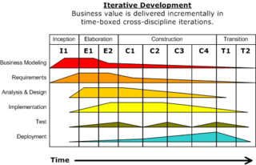

# Enterprise Architecture Methods Introduction

## Outline

- Enterprise Architecture Methods
  - Rational Unified Process (RUP)
  - UN/CEFACT Modelling Methodology (UMM)
  - Federal Enterprise Architecture Framework (FEAF)
- Enterprise Architecture Frameworks
  - The IEEE 1471-2000 Standard
  - The Zachman Framework - The Open Group
  - Architecture Framework (TOGAF)OMG's
  - Model-Driven Architecture (MDA)
  - Other Frameworks

## Enterprise Architecture Methods

### Definitions

#### Architecture methods

An **architecture method** is a structured collection of techniques and process steps for creating and maintaining an enterprise architecture.

Architecture methods typically display the various phases of architecture lifecycle, what deliverables should be produced at each stage and how they are verified or tested.
The architecture methods are basically the tools that are developped to control the architecture lifecycle and develop the enterprise architecture framework.

#### Framework

A **framework** is a real or conceptual structure intended to serve as a support or guide for the building of something that expands the structure into something useful.

In computer systems, a framework is often a layered structure indicating what kind of programs car or should be built and how they would interrelate.

### Rational Unified Process (RUP)

The Rational Unified Process is an iterative software development process framework. It defines an iterative process, as opposed to the classical waterfall process, that realise software by adding functionality to the architecture at each increment.

On the image displayed above we can the the RUP phases as columns and disciplines in lines. Each discipline has its activity displayed as the thickness of the lines.
For instance, their is little effort put into tests during the Inception phase however between Construction and Transition phase, we've got a lot of work going on.

### UN/CEFACTs Modeling Methodology (UMM)

UN/CEFACTs Modeling Methodology (UMM) is a UML modeling approach to design the business services that each business partner must provide in order to collaborate. It provides the business justification for the service to be implemented in a service-oriented architecture (SOA).

