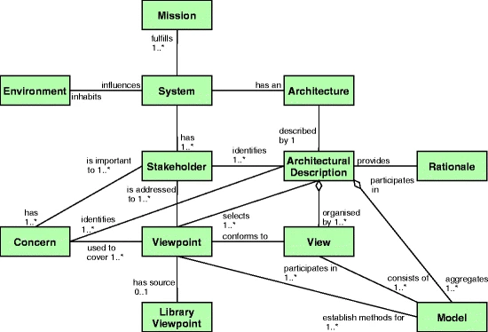
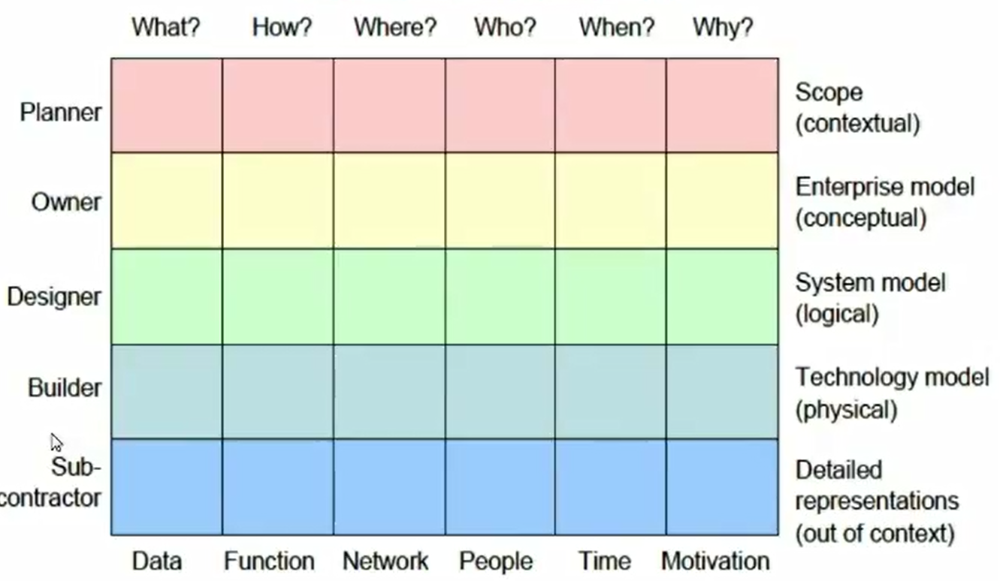
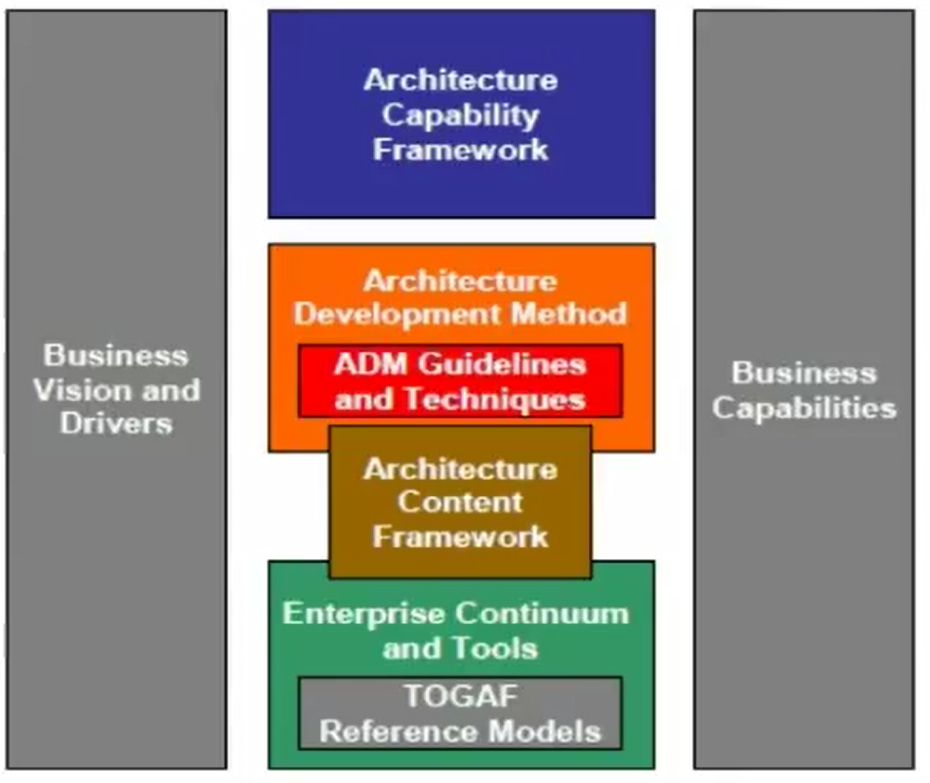
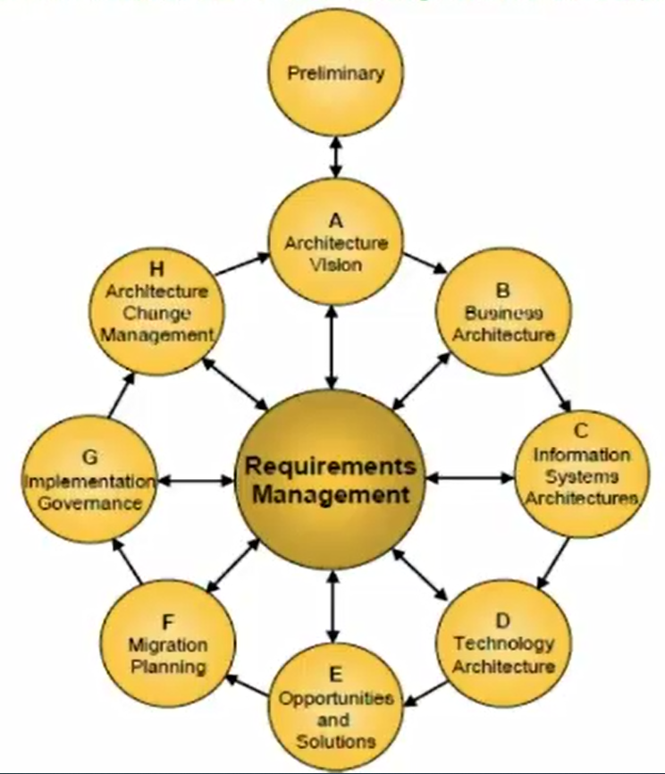

# Enterprise Architecture Methods Introduction

## Outline

- Enterprise Architecture Methods
  - Rational Unified Process (RUP)
  - UN/CEFACT Modelling Methodology (UMM)
  - Federal Enterprise Architecture Framework (FEAF)
- Enterprise Architecture Frameworks
  - The IEEE 1471-2000 Standard
  - The Zachman Framework - The Open Group
  - Architecture Framework (TOGAF)OMG's
  - Model-Driven Architecture (MDA)
  - Other Frameworks

## Enterprise Architecture Methods

### Definitions

#### Architecture methods

An **architecture method** is a structured collection of techniques and process steps for creating and maintaining an enterprise architecture.

Architecture methods typically display the various phases of architecture lifecycle, what deliverables should be produced at each stage and how they are verified or tested.
Architecture methods are essentially the tools designed to manage the architecture lifecycle and develop the enterprise architecture framework.

#### Framework

A **framework** is a real or conceptual structure that serves as a support or guide for building something useful. In computer systems, a framework often represents a layered structure indicating what kinds of programs can or should be built and how they interrelate.

### Rational Unified Process (RUP)

The Rational Unified Process is an iterative software development process framework. It defines an iterative process, as opposed to the classical waterfall process, that realizes software by adding functionality to the architecture at each increment.

On the image displayed above we can the the RUP phases as columns and disciplines in lines. Each discipline has its activity displayed as the thickness of the lines.
For instance, their is little effort put into tests during the Inception phase however between Construction and Transition phase, we've got a lot of work going on.

### UN/CEFACTs Modeling Methodology (UMM)

UN/CEFACT's Modeling Methodology (UMM) is a UML modeling approach to design the business services that each business partner must provide in order to collaborate. It provides the business justification for the service to be implemented in a service-oriented architecture (SOA).

### IEEE 1471-2000

The IEEE 1471 is a standard for system, software, and enterprise architectures. It has been replaced by the ISO/IEC/IEEE 42010 standard which will be described later on. IEEE 1471 is similar to the framework of Zachman.

Lets discuss about the diagram shown above, when describing a system, the system needs to have (at least) a mission. This system will be deployed on an environment (a software is deployed on a server/machine) and will influence it.
The system has an archictecture and one or multiple stakeholders. This architecture has to be described by one or multiple views. These views allows the creation of viewpoints that are addressed to the stakeholders depending on the concerns. These views, viewpoints and architecture description are related to models which are the data of the architectural description.

### IEEE 42010

ISO 42010 addresses the creation, analysis and sustainment of architectures of systems through the use of semantically rigorous architecture descriptions.

> [!IMPORTANT]
> This standard is the base of TOGAF and other current frameworks.
> You might need to understand ISO-42010 before learning TOGAF.

For more detail please refer to : [Github - Nicolas Goyon - ISO 42010](https://github.com/nicolas-goyon/ISO-42010)

## Enterprise Architecture Frameworks

### Zachman Framework

Jhon Zachman introduced the first and best-known enterprise architecture framework (Zachman 1987).
It depict the design artefacts that constitute the intersection between roles in the design process that is :

- Owner,
- Designer
- Builder

And the product abstractions that is :

- What (material) is it made of
- How (process) it works
- Where (geometry)

For instance :

|                                 | What                                                          | How                                                            |                              Where                               | Who                                                              | When                                                    | Why                                                  |                         |
| ------------------------------- | ------------------------------------------------------------- | -------------------------------------------------------------- | :--------------------------------------------------------------: | ---------------------------------------------------------------- | ------------------------------------------------------- | ---------------------------------------------------- | ----------------------- |
| **Executive perspective**           | Inventory identification *(list: inventory types)*            | Process identification *(list: processes types)*               |     Distribution identification *(list: distribution types)*     | Responsibility identification *(list: responsibility types)*     | Timing identification *(list: Timing types)*            | Motivation identification *(list: motivation types)* | **Scope context**       |
| Business Mgmt perspective       | Inventory definition *(Business entity & relations)*          | Process definition *(business transform & input/output)*       |   Distribution definition *(business location & Connections)*    | Responsibility definition *(Business Role & Work products)*      | Timing Definition *(Business Interval & moments)*       | Motivation definition *(Busines End & means)*        | **business concept**    |
| **Architect perspective**           | Inventory representation *(System entity & relationship)*     | Process representation *(System transform & input/output)*     |   Distribution representation *(System location & connection)*   | Responsibility representation *(System Role & Work product)*     | Timing Representation *(System interval & moments)*     | Motivation representation *(System end & means)*     | **System Logic**        |
| **Engineer perspective**            | Inventory specification *(Technology entity & relationship)*  | Process specification *(Technology transform & input/output)*  | Distribution specification *(Technology location & connection)*  | Responsibility specification *(Technology Role & Work product)*  | Timing specification *(Technology interval & moments)*  | Motivation specification *(Technology end & means)*  | **Technology Physics**  |
| **technician perspective**          | Inventory Configuration *(Tool entity & relationship)*        | Process Configuration *(Tool transform & input/output)*        |    Distribution Configuration *(Tool location & connection)*     | Responsibility Configuration *(Tool Role & Work product)*        | Timing Configuration *(Tool interval & moments)*        | Motivation Configuration *(Tool end & means)*        | **Tool components**     |
| **Enterprsise perspective (users)** | Inventory Instantiations *(Operations entity & relationship)* | Process Instantiations *(Operations transform & input/output)* | Distribution Instantiations *(Operations location & connection)* | Responsibility Instantiations *(Operations Role & Work product)* | Timing Instantiations *(Operations interval & moments)* | Motivation Instantiations *(Operations end & means)* | **Operation instances** |
|                                 | **Inventory Sets**                                            | **Process flows**                                              |                    **Distribution networks**                     | **Responsibility assignments**                                   | **Timing cycles**                                       | **Motivation intentions**                            |                         |

### The Open Group Architecture Framework (TOGAF)

TOGAF has the following main components :

1) An architecture capability Framework, which addresses the  organisation, processes, skills, roles and responsibilities
2) The architecture development method (ADM), which provices a 'way of working' for architects
3) The architecture Content Framework, compose of four closely interrelated architectures :
   1) Business Architecture
   2) Data Architecture
   3) Application Architecture
   4) Technology (IT) Architecture
4) The Enterprise Continuum, which comprises various reference models, such as :
   1) Technical Reference Model
   2) The Open Group's Stardards Information Base (SIB)
   3) The Building Blocks Information Base (BBIB)

Here is a basic illustration of TOGAF :

#### TOGAF Architecture development method

TOGAF's ADM is iterative, over the whole process, between phases, and within phases. For each iteration of the ADM, a fresh decision must be taken as to :

- The breadth (width) of coveration of the enterprise to be defined.
- The level (depth) of detail to be defined.
- The extend of the time horizon aimed at, including the number and extend of any intermediate horizons.
- The architectural assets to be leveraged in the organisation's Enterprise Continuum, including assets created in previous iterations of the ADM cycle within the enterprise and the assets avaliable elsewhere in the industry.

### OMG's Model-Driven Architecture (MDA)

The OMG has extended the focus of MDA to the computation-Independent Model (CIM) layer, in which the business aspects of a company are covered. Thus, MDA comprises three abstraction levels whith mappings between them :

1. The requirements for the system are modelled in a CIM describing the situation in which the system will be used.
2. The Platform-Independent Model (PIM) describes the operation of a system while hiding the details necessary for a particular platform, from one platform to another.
3. A Platform-Specific Model (PSM) combines the specifications in the PIM with the details that specify how that system uses a particular type of platform.