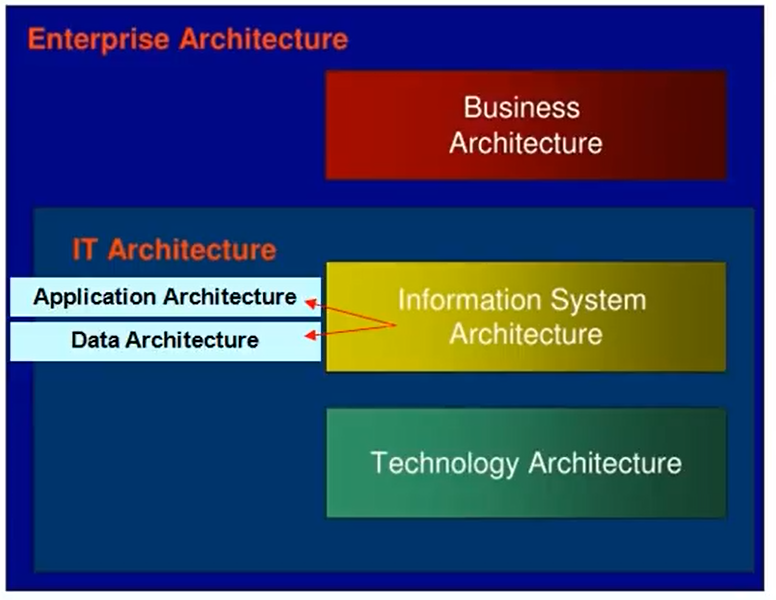
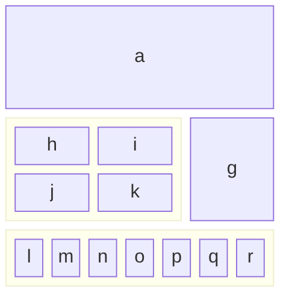
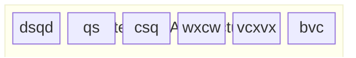

# The open group architecture Framework TOGAF

## What should an Architectural Framework Contains ?

A **foundational structure**, or set of structures, which can be used for developing a broad range of different architectures.

It should contain a **method** for designing an information system in terms of a set of building blocks, and for showing the building blocks fit together.

It should contains a **set of tools** and provide a common vocabulary.

It should also include a **list of recommended standards** and compliant products that can be used to implement building blocs.

## Enterprise architecture

An enterprise architecture is :

- How the business meets it's strategy and goals
- Support of business strategy and goals
- how the technology fits together

